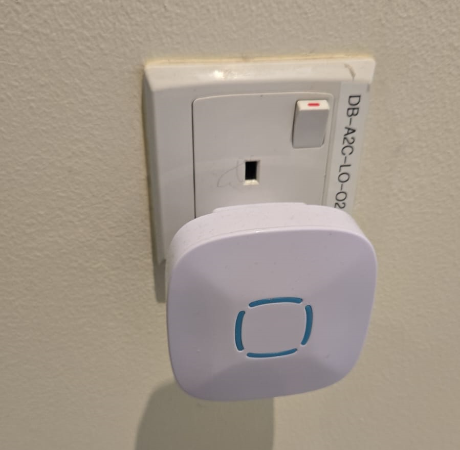

--------------------
Operational Protocol
--------------------

**Authors:** Gayathri Satheesh `gs2750@nyu.edu <gs2750@nyu.edu>`_, Maitha Al Shaali `ma6895@nyu.edu <ma6895@nyu.edu>`_, Haidee Paterson `haidee.paterson@nyu.edu <haidee.paterson@nyu.edu>`_, Hadi Zaatiti `hadi.zaatiti@nyu.edu <hadi.zaatiti@nyu.edu>`_

Based on a previous version of the protocol from Aniol Santos Angles.

Find a PDF version of the protocol below:
- `MEG Lab manual PDF download <https://github.com/BioMedicalImaging-Core-NYUAD/neurowaves-lab-documentation/releases/download/v-report-docs/meg-lab-manual.pdf>`_

.. contents::
   :local:
   :depth: 2
   :backlinks: entry

Lab booking and schedule
------------------------

.. warning::

   Bookings should not take place on a Monday morning, as this is when Helium refills are scheduled and it is not possible to acquire data during this period.

Checks Completed by MEG Scientist Prior to Experiment
-----------------------------------------------------

The MEG lab is provided to the project owner after the following checks and tests have been performed successfully.

#. KIT system is in an operational status when:
    - Helium levels are sufficient to conduct an experiment
    - Quality of the data from SQUIDs sensor has been verified
    - Empty-room data has been acquired and noise levels have been computed and assessed

#. Vpixx system is operational when:
    - Trigger events are tested
    - Projector is in a running state
    - Response boxes must be tested for correct button responses

#. Communication system with participant are operational when:
    - Microphone outside the MSR, to communicate to the participant works correctly
    - Microphone inside the MSR for participant to communicate with project owner works correctly
    - Earphones with disposable single use foam earplugs for participant to hear the project owner outside the MSR works correctly
    - Camera inside MSR for visualising the participant

#. Laser scanner system is operational when:
    - Laser scanner computer works correctly
    - Laser pointer/surface scanner is operational

#. Personal Protective Equipment/Clinical Consumables are available including:
    - clean foam earplugs
    - head caps
    - scrubs
    - clinical application tape for HPI coils on participant face
    - gloves
    - linen
    - face baby wipes
    - normal tissue paper
    - head caps
    - kitchen towels
    - glasses for vision correction -6 to +6 in 0.5 increments
    - a sign to be used if the participant is a female wearing a veil/head covering

Should you require new items please contact the team with your request.

Performed by the project owner - Prepare the lab equipment (prior to participant arrival)
-----------------------------------------------------------------------------------------

The steps below should be **performed by the project owner** prior to the arrival of the participant and should be completed in the following the order.
These procedures take an estimated time of 20 mins.

#. Prepare MSR:
    - Make sure the MSR has no metal objects inside
    - Switch the heater off

    .. figure:: figures/meg-operationprotocol/heater.png
        :alt: Heater Button Image
        :align: center
        :scale: 40%

        Heater Button

    - Prepare bedsheets and pillowcases
    - Clinical Tape is usually stored in the drawers inside the plastic drawers inside the MSR
        - or/also in the top right wooden drawer outside the MSR, on the right side of the `Stimulus computer`
    - Prepare 12 pieces of tape, those will be used to set the `HPI coils` on the participant's head

#. Marker box check:
    - Ensure that the `Marker Box` found inside the MSR has enough battery
        - Power up the `Marker Box` by flipping the `Power` switch up
        - If there is enough battery, the red LED 'Low batt' should go on for a second and then back off
        - If there is not enough battery, the red LED 'Low batt' is either on all the time or never comes on for a second as previously
            - In this case, change the batteries of the Box, recharged batteries are available under the `Stimulus` computer

    .. figure:: figures/meg-operationprotocol/Marker_box_power.png
        :alt: Trigger Box
        :align: center
        :scale: 60%

        Marker box power indicator

    - Uncoil the five HPI marker coils that are linked to the `Marker Box`

#. Trigger Box preparation:
    - The `Trigger Box` is outside the MSR and pictured below

    .. figure:: figures/meg-operationprotocol/trigger_box.png
        :alt: Trigger Box
        :align: center

        Trigger Box found above the `MEG Main PC`.

    - Ensure that the `Source` button is set to `LPT1/PC` which is on the left side

#. If project owner requires empty-room data prior to experiment:
    - Turn off the MSR lights and put the light brightness to low
    - Close the MSR door without a particpant inside
    - After the previous steps, on the `MEG Main PC` computer, open `MEG160` software
    - Then, Menu -> Acquire -> Auto Tuning -> Ok
        - Wait for the auto-tuning to be done
    - From Menu -> Acquire -> MEG Measurement -> Monitor and Acquisition window should open
        - In the 'Sensor Control' window ensure or set these parameters *NB are only to be used for empty-room data and not for a neuro-activity experiment measurement)*:
            - HPF to `0.1 Hz`
            - LPF to `1 KHz`
            - BEF to `THRU`
        - Click on 'Sensor Check'
        - Let the Sensor Check run for around 2 minutes
        - Uncheck 'Sensor Check'
        - Make sure that the sensor display identical sinusoidal wave
        - Remember that `Sensor 91` is broken and will not display a sine wave

    - In the ‘Data Acquisition’ window enter the following:
    - Patient ID: sub-emptyroom
    - Name: sub-emptyroom_<data in YYYYMMDD>
    - Foldername: C: \MEG160\Bin\emptyroom
    - After ensuring the MSR door is closed, press `Lock`
        - The sensor measurements will oscillate rapidly, wait until the values are stable, i.e., no upward or downward trend is observed
    - Continuous Mode -> Start
        - Set Sampling Rate to 2000 Hz
        - Set Time to `180 seconds`
        - then, `Start Acquisition`
    - When recording is done, press `Unlock`
    - Close the `MEG Measurement` window
    - Open the MSR door

#. Prepare Vpixx systems:
    - Ensure that the three `Vpixx` boxes are turned on: Soundpixx, Propixx and Responsepixx
    - Turn on the computer if it is off, boot under Windows (it will default to Ubuntu)
    - Settings of Vpixx computer. Ensure that:
        - Screens are in multiple displays (not mirror display)
            - Right-click on desktop > Display settings > Extend these displays > Keep changes
    - Set up Vpixx either through the LabMaestro platform (preferred) or through bash script **VPutil** GUI
    - **LabMaestro**
        - Open `LabMaestro` found on the desktop

            .. figure:: figures/meg-operationprotocol/LabMaestro_icon.png
                :alt: LabMaestro_icon
                :align: left
                :scale: 30%

                LabMaestro icon

        - To turn on the PROPixx screen, click on the 'Wake All PROPixx' button found on the menu on top of the LabMaestro platform

            .. figure:: figures/meg-operationprotocol/Propixx_awake.png
                :alt: LabMaestro Platform
                :align: center
                :scale: 50%

                LabMaestro Platform

    - **VPutil**
        - Open 'VPutil'
        - Run `ppx a` and `Enter`,
        - Check if the screen inside the MSR is on, if the screen is off then:
        - run `ppx s`, then run `reset`, then wait for a minute, run `ppx a`

        - Ensure the orientation (vertical flip) of the screen inside the MSR is correct, if not:
        - Open `LabMaestro`,
        - On the left of the platform, choose PROPixx from the menu
        - Check `Rear Projection` box

            .. figure:: figures/meg-operationprotocol/LabMaestro_rear_projection.png
                :alt: Incorrect screen orientation fix
                :align: center
                :scale: 50%

                Incorrect screen orientation fix

#. Verify your experiment script:
    - If using `PsychToolBox`:
        - Open MATLAB (2022b)
        - Access your experiment `.m` script and launch it
        - Make sure you arrive to the `Introduction Page` mentioned in the :ref:`design_experiment` section. This is to ensure MEG data recording can be started before the experiment begins
    - You can do a quick test run to make sure that trigger signals are appearing correctly on the `MEG160` software

.. warning::

   For a real participant, make sure to turn off the Wifi on the `Stimulus Computer` so that the experiment is not interrupted by an update or other notification from the internet.

    - Response Device
        - Button box: make sure all the optical cables form the button boxes are plugged in correctly as shown in the picture

        .. figure:: figures/meg-operationprotocol/Left_Response_Button_Box.jpeg
            :scale: 50%
            :alt: Left Button Box
            :align: center

            Left response box

        .. figure:: figures/meg-operationprotocol/Right_Response_Button_Box.jpeg
            :scale: 50%
            :alt: Projection Mode
            :align: center

            Right response box

        .. figure:: figures/meg-operationprotocol/response_plugs.jpg
            :scale: 30%
            :alt: Projection Mode
            :align: center

            Plugging the response box: Top row is the `right` response box, bottom row is the `left response box`.

#. Microphone inside MSR:
    - Make sure the sound box is switched on - located under the Stimulus computer - if not click on the green round button
    - Check if you can hear the participant through the speakers, talking from inside the MSR to the microphone attached to the dewar
       .. figure:: figures/meg-operationprotocol/Microphone_inside.jpg
            :alt: Participant microphone
            :align: center
            :scale: 50%

            Participant microphone

#. Earplugs
    - Check the earplugs and make sure the participant can hear you
        .. figure:: figures/meg-operationprotocol/Earplugs.jpg
            :alt: Earphones with foam earplugs
            :align: center
            :scale: 20%

            Earphones with foam earplugs

#. Prepare the `FastScan` computer:
    - If the `FastScan` computer is not turned on:
        - make sure that FastScan device is off (the flat black box next to the monitor, picture below)
        - turn on the computer then launch `FastScanII` program
        - turn on the FastScan device

        .. figure:: figures/meg-operationprotocol/fast_scan_device.png
            :alt: Fast Scan device
            :align: center

            Fast Scan device

#. Turn-off the doorbell ring at the entrance of the lab by turning off the plug [IMAGE]

    Deactivate the doorbell by pressing the plug button.

Perform the MEG Experiment (Participant is present)
---------------------------------------------------

#. If the participant is a veil-wearing female:
    - place sign on door
    - block door with the isolation screen found behind the laser scan room door

#. Welcoming the participant and providing them with explanations
    - [WELCOME] Thank you for joining our study. Is this your first time in the MEG?
    - [GENERAL OVERVIEW] No worry, Let me explain to you now what we are going to do today.
    - [BEFORE MEG - HEAD SHAPE] Before you are going into the MEG, we need to do some preparation.
    - Explain the FastScan head laser scan:
        - I will scan your head shape with a laser gun [show the FastScan]
        - This is giving us a 3D reconstruction of the shape of your head
        - To do that, you need to sit there and not move for around 5-7 minutes
        - Moreover, I have to mark five points on your forehead and close to your ears with this [show it] washable ink,
        - it will disappear after just one shower [show the phantom head with the points]
        - Why are we doing that? To know where your head is located while you are in the MEG.
        - This is important for the study we are running because we need to know where the data recorded by the MEG sensors
        - that measure the tiny changes in the magnetic field generated by the brain activity, is coming from.
        - You know, different people have different head shape/size,...
        - and they place the head in slightly different sites relative to the MEG sensors.
        - Why the points? When we are in the MEG room
        - I will tape you small things called ‘head position coils’ in the places you have these painted points
        - and this will tell us where your head is relative to the MEG sensors
        - It looks a bit weird at the beginning, but you get used to it soon(I did the experiment on myself)
        - [BEFORE MEG - CLOTHES]
            - Another important thing is that you cannot go inside of the MEG room with any kind of metallic object
            - because it will create an artifact on the MEG sensors.
            - To ensure that, I have to ask you to wear this MEG compatible clothes (like the ones in the hospitals).
            - Please, if you feel comfortable with that, you should take off your bra (most of the time there are small metallic trips or parts).
        - [INSIDE MEG]
            - Explain the study-specific instructions here or give them an instruction manual to read.\
            - Now, let me recap what we will do today. You need to fill the forms, scan your brain shape,
            - then you need to change clothes. You go to the MEG room, we tape coils in your  forehead. And then, you will do the tasks.
        - [END OF EXPLANATION] Is everything clear? Do you have any questions? Do you feel comfortable? Are you ok? Please let me know, this is important for us that you understand everything.

#. Fill up forms
    - Ensure that we have the electronically signed all consents and any forms needed specifically for your experiment, or allow them to fill in/sign by hand at the time of the session

#. Check up MEG incompatibilities
    - Participants **MUST** change from their street clothes into scrubs provided clothing. Underwear without any metal and socks can be kept on. Bras should be removed.
    - Make sure they have NO metallic objects in the body/eyes
    - Confirm that they do not have:
        - Surgical clips, artificial heart valve, implanted drug pump
        - Bullet
        - Cochlear implant or hearing aid
        - Dental Retainers or braces
        - Make-up, especially red color makeup
        - Hair pins
        - Jewelry and piercings
        - Keys
        - Phone
    - If the subject arrives with make-up, ask them to completely remove it
    - If the subject wears glasses, ask them to remove the glasses and provide them with an MR compatible glasses from the briefcase found in the lab
        - Determine their vision prescription and provide them with the closest matching pair of glasses from the briefcase.
           - available lens strengths for vision correction -6 to +6 in 0.5 increments

        .. figure:: figures/meg-operationprotocol/glasses_case.png
            :alt: Glasses briefcase
            :align: center

            MR safe glasses briefcase.

    - Ask the participant to put their phone on Airplane mode
    - Put your own phone and all other phones in the MEG lab on airplane mode
    - Call the security guard on `85849` and ask them to turn off their walkie-talkies for the duration of the experiment

    .. figure:: figures/meg-operationprotocol/phone.png
        :alt: Phone
        :align: center
        :scale: 50%

        Phone in MEG lab with a label of security guard office.

#. Perform the FastScan laser head scan
    - Capping the participant
        - Put a swimming cap on the head of the participant
        - Make sure the cap is as smooth as possible on the participant's head
        - Participants with long hair, can keep most part of their hair outside the cap behind their ears and onto the back
        - The ears must be clear of hair
        - The cap must cover all the hair that can be seen at the anterior, left and right parts of the head
        - Smoothen the hair under the cap as much as possible, excess long hair can be drawn to outside the cap at the cerebellum level
        - The goal is that the cap takes the shape of the skull at best
    - Mark the fiducials - there are a total of 8
        - Use the “T” template, with the line aligning the participant’s nasion as in the below picture

        .. figure:: figures/meg-operationprotocol/Marker_guide_template.png
            :alt: Template and Nasion
            :align: center

            "T" template on the left and nasion/pre(auricular) positions on the right

        - Mark the nasion using a pen (fiducial 1)
        - Adjust the fold in the "T" template to the participants nasion
        - Using a pen marker, mark fiducials 6, 7 and 8 by using the three holes in the "T" template

        .. figure:: figures/meg-operationprotocol/fiducials.png
            :alt: Fiducials
            :align: center

            Fiducials numbered by the order they should be laser scanned with.

        - Mark the left and right pre-auriculars (1cm anterior to the tragi) and the right and left tragi (2, 3, 4,and 5)
        - Put on the neck brace
            - Place a tissue over the area closest to the mouth on the neck brace for sanitary purposes - see picture

        .. figure:: figures/meg-operationprotocol/neckbrace.png
            :alt: Neck brace with tissue for sanitary purposes
            :align: center

            Neck brace with tissue for sanitary purposes

    - Perform laser scan
        - Once FastScan is finished initializing (indicated at the bottom of the software UI):
            - Open `FastScan II` software on the computer
            - Press 'New'
            - Ensure the scanner is in Sweep mode (add [IMAGE])
            - Ask the participant to close their eyes and avoid any movements until scan is finished
            - Point the laser gun at the `laser scanner reference receiver` (the box on the ring you place around the neck, see below) with a half-click, followed by a full click.

            .. figure:: figures/meg-operationprotocol/reference_point.png
                :alt: Reference point
                :align: center
                :scale: 50%

                Laser scanner reference receiver

            .. figure:: figures/meg-operationprotocol/neck_brace.png
                :alt: Neck brace with tissue for sanitary purposes
                :align: center

                Neckbrace with laser scanner reference point on the bottom left

            .. warning::

                ** Error message during scanning **
                If the following error message appear, this means that the laser scan device lost the reference point.

                .. figure:: figures/meg-operationprotocol/error_laser_scanner.png
                    :alt: LaserScan error when device is de-referenced
                    :align: center
                    :scale: 50%

                    LaserScan error when device is de-referenced

               Do not press `Cancel` on the message - point the laser scanner to the reference receiver, first with a half click to point and then a full click.

            - Scan head shape (sweeps) with full click. Tips:
                - Include ALL cap surfaces + surfaces with fiducial points
                - Avoid overlapping sweeps
                - Making sweeps for head and face separately
                - Keep a consistent distance between the head and scanner throughout the scan

                .. hint::

                    Press half a click while using the laser scanner to shift the view on the `FastScan II` software to the current view as seen from the device.
                    This feature allows you to quickly identify areas that are not covered well by the current laser scan.

        - After sweeps, switch to Laser Points and click on Stylus List for points options, ensure that Stylus > Properties > Capture Points (NOT capture lines)
            - Start registering the fiducial points following this order - see picture.
                -The 8 points are as follows:
            - 1. Nasion - between eye-brows
            - 2.(Participant's) left tragus - cartilage of left ear (not marked)
            - 3. Right tragus - cartilage of right ear (not marked)
            - 4. Left marker - pre-auricular marking left ear
            - 5. Right marker - pre-auricular marking right ear
            - 6. Center forehead - center forehead marking
            - 7. Left forehead - left forehead marking
            - 8. Right forehead -  right forehead marking
        - Ensure that you have only 8 points selected on the Stylus List
        - Tell participant they can move back again
    - Return the scanner and box to the foam holder on the table, and make sure none of the cords are on the floor
        `THIS IS A VERY EXPENSIVE DEVICE` - see picture

    .. figure:: figures/meg-operationprotocol/fast_scan_pack.png
        :alt: Fast Scanner Box
        :align: center

        FastScan should ALWAYS be placed like this: laser on foam, cables on table (not floor).

    - Remove the cap from the participant's head and toss into the washing bin
    - Remove the neck brace
    - Save as (this is the .fsn files)
    - Create folder: FastScan Files/<Lab_Name>/<Study CODE>/sub_<subjectID>/ sess_<session_number>
    - [e.g. sub_12/sess_01]
    - Filename: `sub-<subjectID>-sess-<session_number>_<data in yyyymmdd>_raw.fsn`
    - Export as basic surface   (check)
    - Save the file as `sub-<subjectID>_basicsurface.txt`
    - Press `Yes` to export stylus points aswell name the file as `sub-<subjectID>_laserpoints.txt`

#. Participant goes into the MSR
    - Participant should remove shoes
    - Subject sits on the bed facing the researcher
    - Place the five Head Position Indicator (HPI) coils on the marker points
        - Each HPI coil is marked by a color that corresponds to the position of placement of the coil on the head
        - Bring the forehead markers over the top of the head so the wires are not in the participant’s face
        - The position of the HPI coil on the participant's head should follow the following mapping:

    .. figure:: figures/meg-operationprotocol/Colour_coded_marker_placement.png
        :alt: Colour coded marker placement
        :align: center
        :scale: 30%

        Position of Marker Coils also called Head Position Indicator (HPI) coils

    - Place earphones
    - Assist the participant with the wires while they move into the helmet
    - Place the pink pillow under the participant's legs for the back support
    - If the experiment requires it, place the `Vpixx Response Box` or the `Dial` in their right/or left hand depending on experimental design
        - Optionally tape the box to the mattress, to avoid the box falling
    - Tape any loose wires for the markers and the button boxes
    - **Ensure  that the participant is comfortable**
    - Close and lock the MSR door

    .. figure:: figures/meg-operationprotocol/hpi_coils.png
        :alt: hpi coils
        :align: center

        HPI Coils placement on head.

    - Communicate with the participant
        - Turn on the microphone
        - Talk to the participant through the Vpixx microphone
        - Make sure the participant is replying back and that the voice quality is good
        - Tell them that the experiment is about to start and that they should refrain from any movement
        - Tell them that if they need to speak to you for any urgent issue, they can do this freely at any time
        - Turn off the microphone

#. Run experiment and recording
    - Run your script until it lands on the `Introduction Page` of your script as explained in the :ref:`design_experiment` section.
    - Prepare MEG recording
#. Prepare MEG recording
    - On ‘MEG MAIN PC’ computer, open MEG Lab (on desktop), aka MEG160
    - When the participant is in the MSR, and door is CLOSED
        - From the menu  “Acquire (Q)”, select “Auto Tuning (A)” > OK On “Monitor and Acquisition” window > Sensor Control
        - From the menu “Acquire (Q)”, select “MEG Measurement (Q)”
        - On “Monitor and Acquisition” window > ‘Data Acquisition’
            - Patient ID: <projectname>_<subjectID>
            - Patient Name: <projectname>_sub<subjectID>_sess<session_number>_<data in ddmmyyyy> [e.g., CODE_sub001_sess01_10032023]
            - Foldername: D:\MEGDATA\<Lab_name>\CODE\sub<subjectID>
        - “Lock” [only if MSR door is CLOSED]
        - Wait until MEG sensors are stable i.e. no upward or downards trend
    - Perform marker measurement
        - Switch off microphone [IMAGE]
        - On “Monitor and Acquisition” window:
        - Marker measurement > Start > OK - see picture
        - When done, column ‘GOF%’ should be around 99%
        - If not, at least one of the head coils is misplaced (proceed unless there are fewer than 3 head coils in place)
        - Click OK

        .. figure:: figures/meg-operationprotocol/daq_measurement.png
            :alt: Daq measurement
            :align: center

            Continuous mode (left) and Marker measurement (right).

        - A `.mrk` file named as `YYYYMMDD-x.mrk` is automatically generated in the specified directory following the marker measurement, where `x` is an integer 1,2,3,... indicating the order of recording of the marker
        - If your experiment is lengthy i.e. 2 hours long, we recommend that you perform a marker measurement in between, i.e., after 1 hour is elapsed
    - On “Monitor and Acquisition” window:
        - Set/Ensure that:
            - HPF: `0.1 Hz`
            - LPF: `500Hz`
            - BEF: `THRU`
        - Continuous Mode > Start - see above picture
        - Sampling rate: 1000 (default)
        - Time: 4000 [66 minutes] (this is the maximum possible time in the MEG160 software)
        - Start Acquisition
        - You can now safely start your experiment from the `Stimulus computer`
    - If your experiment is lengthy i.e. 2 hours long, we recommend that you perform a marker measurement in between, i.e., after 1 hour is elapsed
    - [While end-of-task text is prompted] Perform marker measurement again as in the step above
    - Main task - block 1 (see points 8-10)
        - Start recording
        - Talk with subject
        - Switch ON USB dial
        - Start task
    - [While end-of-task text is prompted] Marker measurement (see point 7)
    - Main task - block 2 (see points 8-10)
        - Start recording
        - Talk with subject
        - Start task
    - [While end-of-task text is prompted] Marker measurement (see point 7)
    - Main task - block 3 (see points 8-10)
        - Start recording
        - Talk with subject
        - Start task
    - [While end-of-task text is prompted] Perform another Marker measurement (see point 7)
    - Finish up MEG session (see point 11)
        - Talk with subject
#. Stop continuous recording (when task finishes, or if the experiment spans for more than 4000 seconds and needs a new recording)
    - On “Monitor and Acquisition” window - see picture 14:
        - Continuous Mode > Abort
#. Finish up the MEG session (when all tasks are done!)
    - On “Monitor and Acquisition” window:
        - ‘Unlock’ [VERY IMPORTANT STEP, DO NOT OPEN THE DOOR BEFORE IT]
        - Close MEG160 software
#. Take out participant from MSR
    - [ONLY WHEN SENSORS ARE UNLOCK!] Open the MSR door
    - When removing the head-position indicator coils and earphones, do the removal yourself. The coils in particular are very fragile and expensive. Remove with care.
    - Ask participant to change clothes back and put the scrubs in the wash bin (in the laser scan room)
    - Pay the participant and make her sign the receipt.

After the MEG session
---------------------

#. Settings MEG
   - Do not shut down any of the computers. They can all be locked or logged off.
   - Turn on the heater cable [THIS IS VERY IMPORTANT] - see picture above
   - Switch off the dial through the USB board.
   - Turn off the MSR lights.
   - Double-check that you turned the heater cable back on.
#. Clean room
   - Clean the helmet, head-position indicator coils, and button box with alcohol wipes.
   - Wipe down the FastScan neck brace and any other surfaces the participant came in contact with
#. Postprocessing
    - Apply Noise Reduction filter using the reference magnetometers
        - The KIT system is equipped with reference magnetometers on channels 208 till 223, that measures the external magnetic field
        - [Optional] you can noise reduce your SQUID data (channel 0-207) by applying a filter that uses the data from channels 208 to 223
            - Open the produced `.con` file in the default app `MEG160` then apply a Noise Reduction filter using Edit -> Noise Reduction
            - Make sure the Magnetometers on channels 208, 209, 210 are used.
            - Execute the noise reduction, then File -> Save As -> add `_NR` at the end of the file name.
            - Transfer both files to NYU BOX as detailed in the data uploading section.
    - FastScan Instructions
        - Open FastScanII software (icon on desktop)
        - Open <projectname>_sub<subjectID>_sess<session_number>_<date in ddmmyyyy>_raw.fsn file previously generated (Desktop > FastScan Files)
        - Click on ‘Select’ and start dragging your mouse over areas you want to delete
        - To delete points you’ve selected, simply click on the backspace key on your keyboard
        - Then go to Edit > Generate Surface
            - Smoothing = 5mm
            - Decimation = 3mm
    - In the pop-up, click on Apply Basic Surface, then close it
    - To save your head scan, go to File > Save As > [attention to path] FastScan Files/sreenivasan_lab/sub_<subjectID>/ sess_<session_number>/<projectname>_sub<subjectID>_sess<session_number>_<date in ddmmyyyy>.fsn
    - Edit > Generate surface > Apply basic surface
        - Basic surface has fewer than 10,000 points
        - If not, decimate: Generate > Surface Simplification = 0.10 > Apply (Basic Surface)
    - File > Export > save as
        - sweeps by appending ‘_basic’ to the filename: <projectname>_sub<subjectID>_sess<session_number>_<date in ddmmyyyy>_basic
        - points by appending  ‘_points’ to the filename: <projectname>_sub<subjectID>_sess<session_number>_<date in ddmmyyyy>_points
#. Uploading to NYU BOX
    - You should have your own folder on `NYU BOX` named after your project
    - Refer to the uploading data section to upload your data

Perspectives for KIT Operational Protocol
-----------------------------------------

- Automate the `Noise Reduction` filter for multi-subjects in `MEG160`
- Automatic savings of the `.con` files was enabled before but is no longer the case, it would be ideal to go back to automatic saving

Appendix. A: Stylus location and markers
----------------------------------------

.. image:: ../graphic/markers1.jpeg
  :width: 400
  :alt: AI generated MEG-system image

.. image:: ../graphic/markers2.jpeg
  :width: 400
  :alt: AI generated MEG-system image

The following table is a summary of the position of each registered stylus location and whether or not a KIT coil will be placed on that position.

+-------+-----------------+--------------------------------------+
| Index | Body Part       | Marker Coil Information              |
+=======+=================+======================================+
| 1     | Nasion          | KIT: NO, OPM:                        |
+-------+-----------------+--------------------------------------+
| 2     | Left Traps      | KIT: NO, OPM:                        |
+-------+-----------------+--------------------------------------+
| 3     | Right Traps     | KIT: NO, OPM:                        |
+-------+-----------------+--------------------------------------+
| 4     | Left Ear        | KIT: YES, OPM:                       |
+-------+-----------------+--------------------------------------+
| 5     | Right Ear       | KIT: YES, OPM:                       |
+-------+-----------------+--------------------------------------+
| 6     | Center Forehead | KIT: YES, OPM:                       |
+-------+-----------------+--------------------------------------+
| 7     | Left Forehead   | KIT: YES, OPM:                       |
+-------+-----------------+--------------------------------------+
| 8     | Right Forehead  | KIT: YES, OPM:                       |
+-------+-----------------+--------------------------------------+

Appendix. B: Marker coils for KIT order of appearence in .mrk
-------------------------------------------------------------

The registered `.mrk` file containing the position of the HPI coils for KIT.
Using `fieldtrip` function named `ft_read_headshape('PATH TO .mrk')`, we report the order of appearence
of the HPI coils positions in the `.mrk` file below.
This has been tested with many `.mrk` files in the current pluggin setting (last column)

+----------------------+-----------------------------+-------+---------------------+
| Order of appearance  | Placing position of HPI     | Color | Plugging order      |
| in the .mrk          | Coil on head                |       | in Marker Box       |
+======================+=============================+=======+=====================+
| 1                    | Central Forehead (CF)       | Blue  | 2                   |
+----------------------+-----------------------------+-------+---------------------+
| 2                    | Left Ear (LE)               | Red   | 0                   |
+----------------------+-----------------------------+-------+---------------------+
| 3                    | Right Ear (RE)              | Yellow| 1                   |
+----------------------+-----------------------------+-------+---------------------+
| 4                    | Left Forehead (LF)          | White | 3                   |
+----------------------+-----------------------------+-------+---------------------+
| 5                    | Right Forehead (RF)         | Black | 4                   |
+----------------------+-----------------------------+-------+---------------------+

