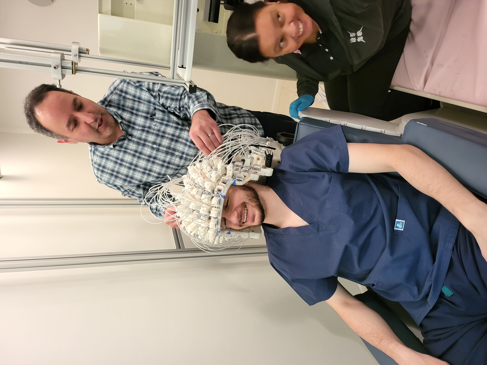

--------------------
System specification
--------------------

System Overview
^^^^^^^^^^^^^^^

The OPM has been installed on the 4th of march 2024.

   Fieldline OPM system with 96 sensors, installed at NYUAD.

Powering on or off the OPM
^^^^^^^^^^^^^^^^^^^^^^^^^^

The OPM racks must always be turned on or off starting from the top rack.

Sensor locations on helmet
^^^^^^^^^^^^^^^^^^^^^^^^^^

To access the sensors locations on the helmet: under the OPM computer, go to `/usr/share/hedscan/doc/Beta2SensorLocations.png`
Also, all saved .fif files contain the location of the channels in (x,y,z) coordinates.

Trigger channels on OPM
^^^^^^^^^^^^^^^^^^^^^^^

OPM to vpixx digital pins connection
""""""""""""""""""""""""""""""""""""

A custom cable have been built to link the Vpixx to the OPM system, below is the pins mapping followed by the
cable datasheet.

.. list-table:: Pin Mapping
   :header-rows: 1

   * - Pin
     - Sender: DB25 Digital Output (female port) VPIXX
     - Receiver: DB37 Digital Input (male port) OPM
   * - 1
     - Dout0
     - Data Bit 0 (pin2)
   * - 2
     - Dout2
     - Data Bit 2 (pin4)
   * - 3
     - Dout4
     - Data Bit 4 (pin6)
   * - 4
     - Dout6
     - Data Bit 6 (pin8)
   * - 5
     - Dout8
     - Data Bit 8 (pin11)
   * - 6
     - Dout10
     - Data Bit 10 (pin13)
   * - 7
     - Dout12
     - Data Bit 12 (pin15)
   * - 8
     - Dout14
     - Data Bit 14 (pin17)
   * - 9
     - Dout16
     - Data Bit 16 (pin20)
   * - 10
     - Dout18
     - Data Bit 18 (pin22)
   * - 11
     - Dout20
     - Data Bit 20 (pin24)
   * - 12
     - Dout22
     - Data Bit 22 (pin26)
   * - 13
     - Ground
     - Ground (pin1)
   * - 14
     - Dout1
     - Data Bit 1 (pin3)
   * - 15
     - Dout3
     - Data Bit 3 (pin5)
   * - 16
     - Dout5
     - Data Bit 5 (pin7)
   * - 17
     - Dout7
     - Data Bit 7 (pin9)
   * - 18
     - Dout9
     - Data Bit 9 (pin12)
   * - 19
     - Dout11
     - Data Bit 11 (pin14)
   * - 20
     - Dout13
     - Data Bit 13 (pin16)
   * - 21
     - Dout15
     - Data Bit 15 (pin18)
   * - 22
     - Dout17
     - Data Bit 17 (pin21)
   * - 23
     - Dout19
     - Data Bit 19 (pin23)
   * - 24
     - Dout21
     - Data Bit 21 (pin25)
   * - 25
     - Dout23
     - Data Bit 23 (pin27)

`Download cable mapping OPM to Vpixx hardware <https://drive.google.com/file/d/1DWAi8QLEHGMBLbLEZJw1SMwIFelStOFb/view?usp=sharing>`_

OPM sensors and direction of measurement
^^^^^^^^^^^^^^^^^^^^^^^^^^^^^^^^^^^^^^^^

In its current state, the OPM measures the radial magnetic field Bz but not yet the tangential directions (Bx, or By).
The hardware is capable of measuring both, but Fieldline has not yet launched the update that would enable both directions to be measured.

Dynamic Range
^^^^^^^^^^^^^

The dynamic range of a sensor is a value representing  the highest "measurable" amplitude, linearly, before the sensor reaches saturation, while removing the noise floor base
that wouldn't allow to distinguish the measurable signal from noise.

.. math::

   D = \frac{B_\text{max}}{B_\text{noise}}

It is often expressed in decibels (dB) as

.. math::

   D_\text{dB} = 20 \, \log_{10} \!\left( \frac{B_\text{max}}{B_\text{noise}} \right).

For an MEG sensor, to compute the dynamic range of the sensor:
- compute the highest measurable amplitude :math:`B_\text{max}` the sensor can measure, this can be done by a DC changing source and observe the measurement
- compute the noise lever :math:`B_\text{noise}` this can be done by recording empty room data and compute the average level of the noise (this is the noise amplitude, that when the measured signal is above it, we can discern the measured signal from the sensor noise)

OPM HPI Coils
^^^^^^^^^^^^^

The HPI coils are installed on specific, `landmarks` places on the head of the participant.

The 6 HPI coils are linked from the OPM system into the MSR via 6 brass cables with characteristics

- TNP 3.5mm Mono Extension (25FT) - 12V Trigger
- IR Infrared Sensor Receiver Extension Extender
- 3.5mm 1/8" TS Monaural Mini Mono Audio Plug Jack Connector Male to Female Cable Wire Cord
- Length: 7.6 meters

A script must be ran before starting the experiment to activate the HPI coils.
The script energises the HPI coils with known sinusoidal waves. (Check Appendix D from OPM Documentation).

The script can be ran at beginning and end to register the positions, then average them together. Coregistration strategies are discussed in the Operational Protocol.